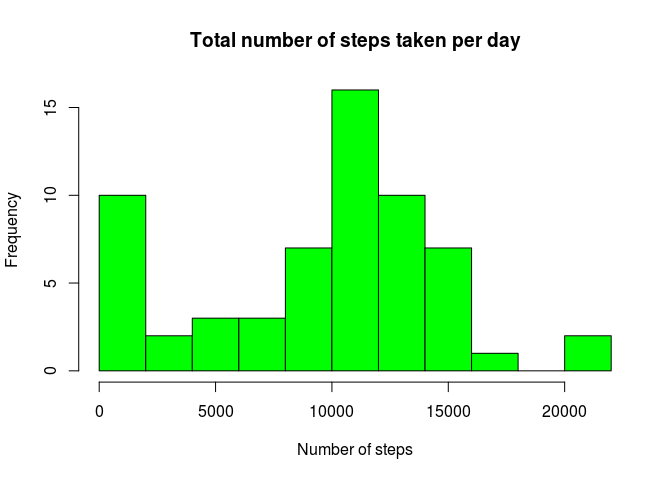

# Reproducible Research: Peer Assessment 1


## Prerequisites

The required dataset is included in the GitHub repository. It can also be downloaded using the following command:

        download.file(url="https://d396qusza40orc.cloudfront.net/repdata%2Fdata%2Factivity.zip", destfile="activity.zip")


## Loading and preprocessing the data


```r
# unzip the dataset
unzip(zipfile="activity.zip")
# read in the data
activity <- read.csv("activity.csv", colClasses=c("integer", "character", "integer"))
# convert activity date into class "Date"
activity$date <- as.Date(activity$date, "%Y-%m-%d")
# convert activity interval into class "factor"
activity$interval <- as.factor(activity$interval)
# display the structure of the dataset
str(activity)
```

```
## 'data.frame':	17568 obs. of  3 variables:
##  $ steps   : int  NA NA NA NA NA NA NA NA NA NA ...
##  $ date    : Date, format: "2012-10-01" "2012-10-01" ...
##  $ interval: Factor w/ 288 levels "0","5","10","15",..: 1 2 3 4 5 6 7 8 9 10 ...
```


## What is the mean total number of steps taken per day?


```r
# create an array containing the total number of steps for each day
dailySteps <- tapply(activity$steps, activity$date, sum, na.rm=TRUE)
# plot a histogram of the total number of steps per day
hist(dailySteps, breaks=10, col="green", xlab="Number of steps", main="Total number of steps taken per day")
```

 

```r
# calculate the mean and the median of the total number of steps per day
mean(dailySteps)
```

```
## [1] 9354.23
```

```r
median(dailySteps)
```

```
## [1] 10395
```


## What is the average daily activity pattern?


```r
# create an array containing the mean number of steps for each interval
intervalSteps <- tapply(activity$steps, activity$interval, mean, na.rm=TRUE)
# plot a line plot of the mean number of steps per interval
plot(intervalSteps, type="l", xaxt="n", xlab="Hour", ylab="Number of steps", main="Mean number of steps taken per five minute interval")
axis(1, at=seq(1, 288, 12), labels=0:23)
```

 

```r
# calculate which interval has the maximum mean number of steps per interval
# and display the value of this maximum as well
intervalSteps[intervalSteps==max(intervalSteps)]
```

```
##      835 
## 206.1698
```


## Imputing missing values


```r
# determine the number of missing values
sum(is.na(activity$steps))
```

```
## [1] 2304
```

The chosen impute strategy will use the mean number of steps for the interval concerned to fill in missing values.


```r
# create a copy of the dataset
imputedActivity <- activity
# create a logical vector to locate missing values
hasMissing <- is.na(imputedActivity$steps)
# replace the missing values with the appropriate interval means
imputedActivity[hasMissing, 1] <- intervalSteps[imputedActivity[hasMissing, 3]]
# to verify, determine the number of missing values (should be 0)
sum(is.na(imputedActivity$steps))
```

```
## [1] 0
```

```r
# to verify, determine if the interval averages are unchanged (should be TRUE)
intervalSteps2 <- tapply(imputedActivity$steps, imputedActivity$interval, mean, na.rm=TRUE)
identical(intervalSteps, intervalSteps2)
```

```
## [1] TRUE
```

Let's see the effect of our imputation:


```r
# create an array containing the total number of steps for each day
dailySteps2 <- tapply(imputedActivity$steps, imputedActivity$date, sum, na.rm=TRUE)
# plot a histogram of the total number of steps per day
hist(dailySteps2, breaks=10, col="green", xlab="Number of steps", main="Total number of steps taken per day")
```

 

```r
# calculate the mean and the median of the total number of steps per day
mean(dailySteps2)
```

```
## [1] 10766.19
```

```r
median(dailySteps2)
```

```
## [1] 10766.19
```

As we can see, both values have increased.


## Are there differences in activity patterns between weekdays and weekends?

The imputed dataset will be used for this last part.


```r
# Set the locale:
Sys.setlocale("LC_TIME", "en_GB.utf8")
```

```
## [1] "en_GB.utf8"
```

```r
# create a logical vector to locate weekend days
isWeekendday <- weekdays(imputedActivity$date) %in% c("Saturday", "Sunday")
# create a new factor variable in the dataset to indicate type of day
imputedActivity$dayType <- factor(isWeekendday, levels=c(TRUE, FALSE), labels=c("weekend", "weekday"))
# for each type of day, create an array containing the mean number of steps for each interval
weekendSteps <- tapply(imputedActivity[imputedActivity$dayType=="weekend",]$steps, imputedActivity[imputedActivity$dayType=="weekend",]$interval, mean, na.rm=TRUE)
weekdaySteps <- tapply(imputedActivity[imputedActivity$dayType=="weekday",]$steps, imputedActivity[imputedActivity$dayType=="weekday",]$interval, mean, na.rm=TRUE)
# plot a two panel line plot of the mean number of steps per interval for each type of day
par(mfcol=c(2,1), mar=c(2,2,1,0), oma=c(0, 0, 2, 0))
plot(weekendSteps, type="l", xaxt="n", xlab="Hour", ylab="Number of steps", main="Weekend")
axis(1, at=seq(1, 288, 12), labels=0:23)
plot(weekdaySteps, type="l", xaxt="n", xlab="Hour", ylab="Number of steps", main="Weekday")
axis(1, at=seq(1, 288, 12), labels=0:23)
mtext("Mean number of steps taken per five minute interval", outer=TRUE)
```

 


## Notes

Please note that much of this would have been a lot easier (and more readable) using the dplyr and ggplot2 packages. However, I deliberately chose to practice using the base commands for a change.

This file has been created and tested on a 64-bit GNU/Linux system (Ubuntu 15.10) with R version 3.2.3, knitr version 1.11, and RStudio version 0.99.484 installed.
